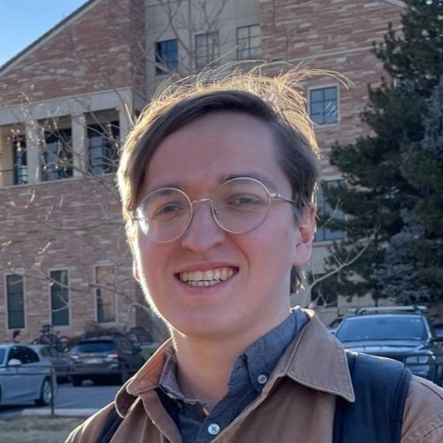

## About Me

  
  

    
Hello! My name is Jacob Spainhour, and I am a fifth year PhD student in the Department of Applied Mathematics at the University of Colorado Boulder. My research interests are broadly characterized by Computational Mathematics, with specific applications interests in numerical optimization and computational geometry. Following completion of my degree, I intend to continue my work in the context of the US National Laboratory system.

  

## Publications

- [Robust Containt Queries over Rational Parametric Curves via Generalized Winding Numbers](papers/RobustContainmentCurves.md)